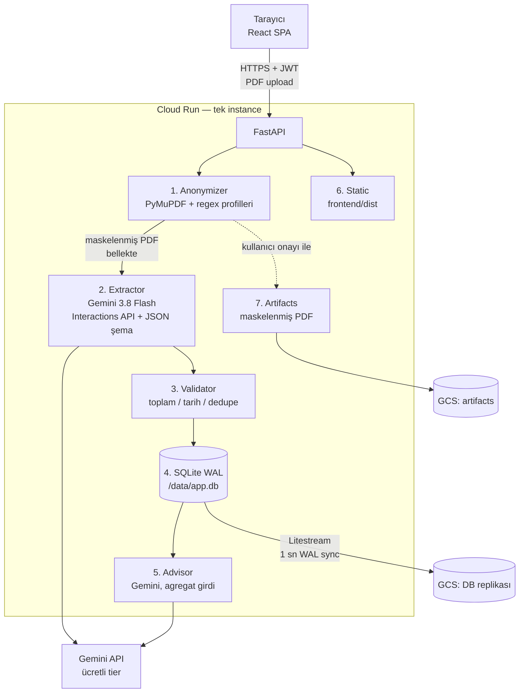

# Mimari

Durum: onaylı · Tarih: 2026-09-16 · Kaynak plan: [00-plan.md](00-plan.md)

## 1. Ürün cümlesi

Kullanıcı banka ekstresini (PDF) yükler. Sunucu, ekstreyi LLM'e göndermeden önce PyMuPDF ve regex tabanlı profillerle maskeler. Maskelenmiş PDF Gemini'ye gider; harcamalar yapılandırılmış olarak çıkarılır, kategorilenir, sade bir dashboard'da gösterilir ve dönem bazlı AI tavsiyesi üretilir.

**Farklılaştırıcı:** Orijinal ekstre diske veya bucket'a hiç yazılmaz; LLM'e yalnızca maskelenmiş PDF gider. Bu iddianın sınırı: regex maskeleme kişisel verinin tamamını yakalayamaz (havale açıklamalarındaki adlar, işyeri adları). Kullanıcıya "tam anonimlik" değil, "ekstrende bulunan kimlik, hesap, kart ve iletişim bilgileri maskelenir" vaadi verilir. Bkz. [security-kvkk.md](security-kvkk.md).

**Kapsam dışı (v1):** Mobil uygulama, açık bankacılık, çoklu para birimi, bütçe/hedef modülü, paylaşımlı hesaplar, taranmış (görüntü) ekstreler, tarayıcı içi maskeleme.

## 2. Bileşenler



Numaralar işlem sırasını gösterir. Orijinal PDF `await request.body()` → `bytes` → PyMuPDF → maskelenmiş `bytes` akışında yalnızca bellekte yaşar; işlem bitince referans düşer, hiçbir noktada diske yazılmaz.

## 3. Veri akışı (tek upload)

1. `POST /api/v1/statements` PDF'i **ham gövde** olarak alır (`Content-Type: application/pdf`; multipart/`UploadFile` kullanılmaz çünkü Starlette dosya parçalarını geçici dosyaya diske yazar), Starlette `max_body_size` 15 MiB, magic byte, şifre (`X-Statement-Password`), sayfa sayısı ve sanitizasyon kontrolü yapar, `202 {id}` döner.
2. Arka plan işi (threadpool): profil tespiti, maskeleme, sızıntı testi. Sızıntı testi başarısızsa `status=mask_failed` ve iş durur (Gemini yok). Maske OK ise Gemini öncesi `masked_sha256=sha256(orijinal)` UNIQUE claim; çakışma `duplicate_statement`.
3. Maskelenmiş bytes Gemini'ye gider (15 sayfa üstü parçalanır). Yanıt JSON şemaya göre parse edilir.
4. Doğrulama katmanı: toplam tutar, dönem, ekstre içi dedupe. Sapma varsa `status=needs_review`.
5. İşlemler SQLite'a yazılır, `status=done`. Frontend 2 sn'de bir `GET /statements/{id}` ile durumu izler.
6. Litestream WAL değişikliklerini 1 sn içinde GCS'e gönderir.

## 4. Repo yapısı

```
ekstre-analyzer/
├── CLAUDE.md                  # ajan giriş noktası
├── Dockerfile                 # Faz 5 (kökte: gcloud run deploy --source Dockerfile yolunu parametre almaz)
├── .dockerignore, .gcloudignore
├── backend/
│   ├── app/
│   │   ├── main.py            # FastAPI app, frontend mount
│   │   ├── config.py          # pydantic-settings
│   │   ├── anonymizer/        # Faz 1: patterns.py, profile.py, layout.py, masker.py, verify.py, sanitize.py
│   │   ├── extractor/         # Faz 2: schema.py, prompt.py, client.py, chunker.py, validate.py, service.py
│   │   ├── advisor/           # Faz 3.5
│   │   ├── auth/              # Faz 4
│   │   ├── db/                # models.py, session.py, alembic/
│   │   ├── api/               # Faz 3: statements, transactions (+ GET /categories), summary, deps, errors, body_limit; sonraki: advice, settings, export, account, admin
│   │   ├── storage/           # Faz 4-5: ArtifactStorage (local, gcs)
│   │   ├── jobs.py            # Faz 3: arka plan işi, bellek içi PDF deposu
│   │   └── ratelimit.py, audit.py, logging.py
│   ├── cli.py                 # typer CLI (Faz 1-2)
│   ├── tests/
│   │   ├── fixtures/          # sentetik PDF üretici + kayıtlı Gemini yanıtları
│   │   └── private/           # gerçek ekstreler, .gitignore'da
│   ├── profiles/              # banka regex profilleri (yaml)
│   └── pyproject.toml         # uv, requires-python >= 3.13
├── frontend/                  # Vite 8 + React 19 + TS, react-router 8, TanStack Query 5, Tailwind 4
├── infra/
│   ├── litestream.yml         # Faz 5
│   ├── entrypoint.sh
│   └── setup.sh               # GCP kurulumu (idempotent)
├── .github/workflows/         # ci.yml, deploy.yml
└── docs/                      # bu klasör (runbooks/ Faz 5'te)
```

## 5. Teknoloji seçimleri

| Katman | Seçim | ADR |
|---|---|---|
| LLM | Gemini 3.8 Flash, Interactions API, `google-genai` ≥ 2.3.0 | [ADR-0001](decisions/0001-gemini-flash-interactions-api.md) |
| PDF girişi | PDF doğrudan gönderilir, PNG yok | [ADR-0002](decisions/0002-pdf-native-input-no-png.md) |
| Maskeleme | PyMuPDF redaction annotation | [ADR-0003](decisions/0003-pymupdf-redaction.md) |
| Veritabanı | SQLite WAL + Litestream → GCS | [ADR-0004](decisions/0004-sqlite-litestream-gcs.md) |
| Çalışma ortamı | Cloud Run, tek instance, CPU always on | [ADR-0005](decisions/0005-cloud-run-single-instance.md) |
| Dağıtım | Tek image, frontend build FastAPI'den servis | [ADR-0006](decisions/0006-single-image-static-frontend.md) |
| Frontend | Vite + React + TS, component kütüphanesi yok | [ADR-0007](decisions/0007-frontend-stack-no-component-lib.md) |

Karar sayılmayan tercihler: Python 3.13, FastAPI, SQLAlchemy 2 + Alembic, Pydantic v2, uv, typer, PyJWT, argon2-cffi, slowapi, structlog, tenacity. Sürümler için [reference/tech-verification-2026-09-16.md](reference/tech-verification-2026-09-16.md).

## 6. Çapraz kesen ilkeler

- **Orijinal PDF asla diske yazılmaz.** Multipart/`UploadFile` kullanılmaz (Starlette geçici dosyaya yazar); ham gövde ile alınır. Kod incelemesi ve grep testleri ile doğrulanır (Faz 1 KK-4, Faz 3 KK-4, Faz 5 kontrol listesi).
- **Sızıntı testi her upload'da zorunlu.** Başarısızsa LLM çağrısı yapılmaz.
- **Tutarlar kuruş cinsinden tamsayı** (`amount_kurus: int`). Float yok.
- **Gemini 3.x kuralları:** `temperature`, `top_p`, `top_k`, `candidate_count`, `thinking_budget` gönderilmez; `thinking_level` kullanılır.
- **Bakım bayrağı tüm yazma uçlarını kapatır:** `POST /statements`, `DELETE /statements/{id}`, `PATCH /transactions/{id}`, `POST /advice`, `PUT /settings`, `POST /export`, `DELETE /account` → `503 maintenance`. Auth uçları ve admin API açık kalır.
- **Log'larda PDF içeriği, işlem açıklaması, e-posta, PDF şifresi yok.** structlog redaction processor.
- **CPU-yoğun iş event loop'ta çalışmaz.** PyMuPDF ve senkron I/O `run_in_threadpool` ile; Gemini `client.aio` ile.
- **Eşzamanlı upload işleme sınırı:** semaphore ile en fazla 2 (bellek bütçesi için).
- **Tek instance varsayımı deploy geçişinde geçerli değil.** Süreç içi bakım bayrağı (`app.state.maintenance`, admin API ile) açılır, yeni revizyon `--no-traffic --tag canary` ile doğrulanır, sonra trafik geçer (Faz 5 runbook).
- **Sağlık ucu `/api/healthz`** (sürümsüz; Vite proxy ve Cloud Run startup probe aynı yolu kullanır).
